# Cryptography

they are protecting the storage and transmission of data.

1. **Confidentiality**: Secrecy of the data (already discussed). This is provided by
   a set of devices called **Ciphers**.

2. **Integrity**: The trustworthiness of the data (also already discussed). Provided by **Hashes**.

3. **Authentication**: Allows a principal (user or machine) to prove their identity,
   or the origin of a piece of data. Provided by Message Authentication Codes
   (**MAC’s**) and **Signatures**.

4. **Non-repudiation**: Prevent that principal from later denying that they
   performed the action. This can be achieved with the help of a **Trusted 3rd
   Party**

## Ciphers

 Algorithm that can be used to obfuscate information, that appears random to anyone
 who does not possess special information called a key

## Trapdoor one-way functions

- A one-way function is a function that is **easy** to compute, but whose **inverse**
is **difficult** to compute.

- The “trapdoor” means that given a special piece of information (the **key**), the
inverse will also become easy to compute

### Examples

- Factoring

    $$f(x, y) = x * y$$

    $$f^{-1}(z)= (x, y), \text{where } x \times y = z$$

- Discrete logarithms

    $$f(x,y,n) = x^y \mod n$$

    $$f^{-1}(z,x,m) = y, \text{where } x^y \mod n = z$$

## Kerckhoff's Principle

Security of a cipher should depend only on the secrecy of the **key**, not on the secrecy of the algorithm.

i.e. the algorithm should be public, and only the key should be secret.

- Algorithms are hard to change

- An algorithm can be audited studied and publicly known
without making it useless.

- Deployed implementations need only protect the key instead of the whole algorithm

## Substitution Ciphers and Caesar (Shift) Cipher

- e.g. Rot13

- Each plain text letter is replaced with **exactly one** cipher text letter.

- The key is the **mapping** between plain text letters and cipher text letters.

## Strength of a Cipher

**Attacks targets**:

- Plain text and cipher text pairs

- Cipher key, (also algorithm if it's private)

1. **Cipher Text only**: The adversary only has access to cipher texts.

2. **Known Plain Text/Cipher Text Pairs**: The adversary has access to some number of
   plain text/cipher text pairs. The more pairs it takes to crack the cipher,
   the stronger the cipher is.

3. **Chosen Plain Text/Cipher Text**: The adversary can generate cipher-plain
   text pairs. Thus, the adversary can **adaptively** select plain texts/cipher
   texts that help her break the cipher.

## Attacks on substitution ciphers

**One-to-one** mapping makes it easy to break the cipher.

**Frequency Analysis** :

If the attacker knows the original
message is in English, then:

- E has probability 0.12
- TAOINSHR has probability 0.06 - 0.09
- DL has probability 0.04
- Etc...

## Poly-alphabetic/Periodic Cipher

- Use multiple substitution ciphers, each with a different key.
- set of n mappings, and change the mapping with every character.
- Wrap around the mapping when you run out of mappings.

### Attack

- Given the period, an attack is possible.

- For small $n$ this is only incrementally harder than a plain substitution cipher

- The attack requires more cipher text examples, but becomes easier if the
  adversary has a plain text/cipher text pair.

## One Time Pad (OTP) / Vernam Cipher

A theoretically unbreakable cipher, also known as the Vernam Cipher after its
inventor. It's a polyalphabetic cipher that never repeats.

- **Alphabet**: Operates at the bit level, with an alphabet of 2 symbols (0 and 1).

- **Key Requirements**:
  - The key must be the same length as the message.
  - The key should be randomly chosen.

- **Encryption Method**:
  - Utilizes bitwise `XOR` operation between the plain text and the key.
  - If a bit in the key is 1, the corresponding plain text bit is flipped.
  - If a bit in the key is 0, the corresponding plain text bit remains the same.

- **Security**:
  - Considered information theoretically secure.
  - Adds exactly as much randomness as the message contains, resulting in a completely random ciphertext.

### Disadvantages

- **Key Length**: Key equals message length, causing bandwidth issues (overhead
  at 100%).
  
- **Single Use**: Each key is usable only once. Reuse compromises security.

- **Malleability**: Flipping a ciphertext bit alters the plaintext. An integrity
  check is essential.

- **Randomness**: Requires a good/true random key source.

### Strength levels

1. **Cipher Text only attack**:
   - **Strength**: Extremely strong.
   - **Reason**: An attacker only has the ciphertext and without the one-time
     pad key, deciphering the plaintext is impossible. Given the ciphertext, all
     plaintexts of the same length are equally probable.

2. **Known Ciphertext/Plaintext attack**:
   - **Strength**: Very strong.
   - **Reason**: Even if an attacker knows a certain plaintext was turned into a
     certain ciphertext using an OTP key, they gain no information about any
     other segment of the key or any other plaintexts, since each part of the
     key is used only once and is random.

3. **Chosen Ciphertext/Plaintext attack**:
   - **Strength**: Very strong.
   - **Reason**: Since the OTP key is random and used only once, knowing how one
     plaintext maps to one ciphertext provides no advantage. An attacker can't
     derive any meaningful patterns or information about the key, making the OTP
     resilient against this type of attack as well.

## Practical Ciphers Requirements

- **Key Length**: Practical ciphers use fixed-length keys, which are notably
  shorter than the message. The key length is independent of the message length.

- **Efficiency**: They are designed to be efficient for both encryption and
  decryption processes.

- **Security**: The ciphertexts produced by these ciphers are computationally
  challenging to decrypt without the correct key.
  - **Note**: The term "computationally difficult" evolves, as
    computers continually advance in power.

## Symmetric Key Ciphers

- **Symmetric Key Ciphers**: These ciphers utilize the same key for both encryption and decryption and are categorized into two main types.

### Block Ciphers

- Encrypts plain text a block at a time, often 64 bits or its multiples.
- The plain text gets divided into blocks for individual encryption.
- If the **last block** isn't of the full block length, it might need **padding**.

### Stream Ciphers

- More akin to OTPs.
- Uses a key to produce a pseudo-random bit sequence.
- These bits are then `XOR`'ed with the cipher text, allowing for bit-by-bit encryption.
- Particularly useful for streaming data, like voice or video.
- A **drawback** is synchronization issues. If bits are lost, the entire stream might need retransmission.

### Usage Prevalence

- Block ciphers are utilized more frequently than Stream Ciphers.
- Historically, many stream ciphers were proprietary, which made their security harder to assess.
- In contrast, several block ciphers are publicly available and have undergone rigorous analysis.

## Cryptosystem Techniques

- In his 1949 paper titled "*Communication Theory of Secrecy Systems*", Claude Shannon identified two foundational techniques for a robust cryptosystem:
  - Confusion
  - Diffusion.

### Confusion

**Confusion** refers to the obscuring of the relationship between the plaintext
(original message) and the ciphertext (encrypted message). Key aspects include:

- **Statistical Analysis**: The primary objective of confusion is to challenge
  statistical analysis. Even if an attacker obtains many known
  plaintext/ciphertext pairs, decrypting other ciphertexts should remain
  non-trivial.

- **Non-linear Encoding**: The encoding mechanism should not be straightforward.
  For instance, encrypting the sum of two messages, should
  not be equal to the sum of their individual encryptions.
  
  $$E_k(M_1 + M_2) \neq E_k(M1) +
  E_k(M2)$$

- **Key Dependency**: Every character in the ciphertext should **rely on the
  entire encryption key**. This ensures that slight changes in the key lead to
  significant changes in the ciphertext, further complicating decryption
  attempts.
  
### Diffusion

**Diffusion** is the property of distributing the impact of individual plaintext
characters over a significant portion of the ciphertext. Key aspects of
diffusion include:

- **Multiple Input Bits Influence**: Each output bit in the ciphertext is
  **affected by numerous input bits from the plaintext**. This ensures that a change
  in a single bit of plaintext results in changes across several bits of the
  ciphertext.

- **Bit Flipping Effect**: Ideally, if you flip just one bit in the **key or
  plaintext**, about half of the output bits should change.

- **Pattern Concealment**: Any recurring **patterns** present in the plaintext get
  **distributed** across the entire ciphertext. This dispersion conceals the
  statistical properties of the plaintext, making cryptanalysis more
  challenging.

## [`XOR` Properties](https://accu.org/journals/overload/20/109/lewin_1915/)

```{toggle}

- **Commutative** : $A ⊕ B = B ⊕ A $

    This is clear from the definition of XOR: it doesn’t matter which way round you order the two inputs.

- **Associative** : $A ⊕ ( B ⊕ C ) = ( A ⊕ B ) ⊕ C$

    This means that XOR operations can be chained together and the order doesn’t matter. If you aren’t convinced of the truth of this statement, try drawing the truth tables.

- **Identity element** : $A ⊕ 0 = A$

    This means that any value XOR’d with zero is left unchanged.

- **Self-inverse** : $A ⊕ A = 0$

    This means that any value XOR’d with itself gives zero

These properties hold not only when XOR is applied to a single bit, but also when it is applied bitwise to a **vector of bits** (e.g. a byte)
```

## Common Block Ciphers

Block ciphers encrypt data in fixed-size blocks, typically using a symmetric
key. The National Institute of Standards and Technology (NIST) has standardized
several block ciphers, among which the most prominent are:

- **DES (Data Encryption Standard)**: It was one of the earliest encryption
  standards adopted widely. However, its smaller key size made it susceptible to
  brute-force attacks.

- **AES (Advanced Encryption Standard)**: This replaced DES as the primary
  encryption standard in 2000. It offers multiple key lengths and is currently
  considered very secure.

Both DES and AES are **iterated block ciphers**. This means they transform each
block of plaintext multiple times using the same process or function, applying
different subkeys derived from the main encryption key.

## DES (Data Encryption Standard)

The **Data Encryption Standard (DES)** has a **56-bit key** and operates on **64-bit data** blocks. Due to advances in computational power, its key length is now too short to withstand modern brute-force attacks. Hence, **DES is no longer deemed secure**.

**Structure of DES:**

- **DES** employs a **Feistel Network**.
- Within each of its several "rounds":
  - The input is divided into two halves: left (L) and right (R).
  - These halves are interchanged.
  - One half undergoes a computation that uses a portion of the key, termed a **sub-key $ K_i $**.
  - The outcome of a round is the input for the subsequent one.
- This pattern is executed for **16 rounds** as per the DES standard.

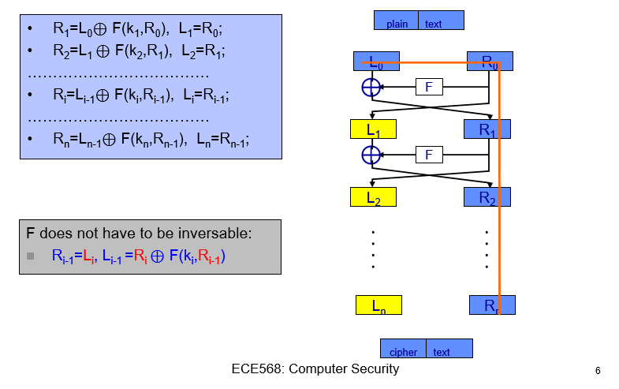

### Feistel Network Overview

**Advantages:**

- Always yields a function that **can be decrypted**, regardless of the function $ f
  $ used.

The Feistel structure guarantees invertibility, which means you can always
derive the original plaintext from the ciphertext using the correct key. This is
due to the design of the Feistel network itself:

1. In each round, the original input is split into two halves: left (L) and
right (R).
2. Only one of these halves (typically the right half) undergoes the
transformation function $ f $, and this transformed value is combined (usually
by `XOR`) with the other half.
3. After this, the two halves are swapped.

Because of this swapping after every round and the fact that **only one-half is
transformed** while the other half remains unchanged, you can always reverse the
process. During decryption, using the **sub-keys in reverse order**, you can easily
retrieve the original input by running the data through the inverse Feistel
operations.

#### Reversible proof

```{toggle}
The Feistel network is a symmetric cryptographic structure that's commonly used in block cipher algorithms. One of its key features is that the encryption and decryption processes are very similar, requiring only the reversal of the key schedule.

In a Feistel network, a block of plaintext is divided into two halves, $ L $ (Left) and $ R $ (Right), before undergoing several rounds of processing. Each round involves a subkey and a round function $ f $, and the process can be summarized for one round as follows:

$$
\begin{align*}
L_{\text{new}} &= R \\
R_{\text{new}} &= L \oplus f(R, K)
\end{align*}
$$

Here, $ \oplus $ represents the bitwise XOR operation, and $ K $ is the subkey for that round. After all rounds are completed, the $ L $ and $ R $ halves are recombined to form the ciphertext block.

To decrypt, you essentially perform the reverse process with the subkeys applied in the reverse order. The round operation for decryption can be expressed as:

$$
\begin{align*}
R &= L_{\text{new}} \\
L &= R_{\text{new}} \oplus f(L_{\text{new}}, K)
\end{align*}
$$

Let's see why the Feistel network is decryptable by applying one round of decryption to one round of encryption:

1. **Encryption**: $ R_{\text{new}} = L \oplus f(R, K) $ and $ L_{\text{new}} = R $
2. **Decryption**: $ L = R_{\text{new}} \oplus f(L_{\text{new}}, K) $ and $ R = L_{\text{new}} $

Substitute $ L_{\text{new}} = R $ and $ R_{\text{new}} = L \oplus f(R, K) $:

$$
L = (L \oplus f(R, K)) \oplus f(R, K)
$$

Since the XOR operation is its own inverse ($ a \oplus a = 0 $ and $ a \oplus 0 = a $), this simplifies to:

$$
L = L \oplus 0
$$
$$
L = L
$$

And similarly for $ R $, proving that you get your original $ L $ and $ R $ back, i.e., the operation is decryptable.

This ability to reverse the process, combined with the application of subkeys in reverse order during decryption, is what makes the Feistel network inherently decryptable.
```

**Drawback:**

- It's **inefficient**, as only one-half of the block is modified in every round.

The Feistel Network design transforms only half the data block in each round.
While this makes the process slower and requires more rounds for thorough
encryption, it ensures easy decryption and simplicity. This design choice
balances efficiency with reliability and ease of use.

### Key Schedule Process in DES

1. The 56-bit main key is divided into two **28-bit** parts.
2. These parts are shifted left by either 1 or 2 bits, based on the specific
   subkey being generated.
3. From these shifted halves, 24 bits are picked from each to produce a **48-bit
   subkey**.

Bit shift & selection is "pseudorandom" due to the specific. These constants
were chosen based on their random distribution.

### Every Round's Computation in DES

1. Starts with an expansion permutation, converting **32 bits** to 48 bits.
2. This is then XORed with a 48-bit subkey, generated from the main 56-bit key.
3. The result passes through **S-boxes**, which substitute and reduce it back to 32
   bits.
4. A final permutation **(P-Box)** is applied to these 32 bits.

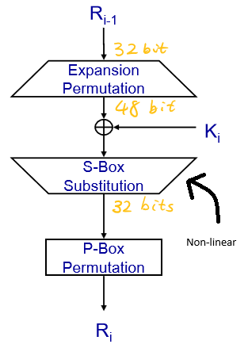

Significantly, the design of the **S-boxes** stands out as the **sole
non-linear** component in DES. These boxes were intentionally designed to have
seemingly random properties. Interestingly, their design was influenced by the
NSA, but the method remains undisclosed.

### Issues with DES

- Originally, DES's 56-bit key was sufficient. But as computing power increased,
  it became feasible to brute-force attack this key (trying all $2^{56}$
  combinations).
- Solutions involved running DES multiple times with longer keys. The popular
  3DES uses a 168-bit key, applying DES thrice with 56 bits of the key each run.
  However, 3DES effectively has a security of 112 bits due to certain
  vulnerabilities.
  


**(Trivia) The "Meet in the middle attack" on 2DES**

```{toggle}
2DES might seem like an intuitive progression from DES to increase security by
doubling the key length, but it's vulnerable to the "meet-in-the-middle attack".
Here's why 3DES was preferred over 2DES:

- In a "meet in the middle attack" on 2DES, if an adversary has a known
  plaintext (PT) and its corresponding ciphertext (CT), they can attempt to
  decrypt the CT using all possible keys for the second DES operation while
  simultaneously encrypting the PT using all possible keys for the first DES
  operation.
  
- When the two operations meet in the middle (i.e., the encrypted PT matches the
  decrypted CT), the adversary can be reasonably certain they've found the
  correct pair of keys.
  
- This means that instead of the $2^{112}$ operations you might expect from a
  naive analysis of 2DES, an adversary only needs on the order of $2^{56}$
  encryption operations and $2^{56}$ decryption operations (plus some storage to
  keep track of intermediate results), which makes the attack much more
  feasible.

- This attack trades off increased storage space (to store the results of the
  encryptions and decryptions) against a drastically reduced computational
  effort.

Thus, to counteract this vulnerability, 3DES was introduced, which applies the
DES algorithm three times with two or three unique keys and isn't susceptible to
this type of attack in the same way.
```

## Cryptosystem Components

- **P (Plaintext Space)**: Represents all possible unencrypted messages.

$$ P = \text{Set of all unencrypted messages} $$

- **C (Ciphertext Space)**: Represents all possible encrypted versions of the
  messages.
  
$$ C = \text{Set of all encrypted messages} $$

- **K (Key Space)**: Represents all potential keys used for encryption and
  decryption.

$$ K = \text{Set of all encryption/decryption keys} $$

- **E (Encryption Functions)**: Contains a unique encryption function for each
  key in **K**. It defines how plaintext from **P** is encrypted into ciphertext
  in **C**.

$$ E = \{e_k : k \in K\} \text{ for } e_k: P \to C $$

- **D (Decryption Functions)**: Contains a unique decryption function for each
  key in **K**. It defines how ciphertext from **C** is decrypted back into
  plaintext in **P**.
  
$$ D = \{d_k : k \in K\} \text{ for }  d_k: C \to P $$

### Relation Between Encryption and Decryption**

For every key $ k $ in $ K $, and for every plaintext $ x $ in $ P $, the
encryption of $ x $ using $ e_k $ followed by its decryption using $ d_k $ gives
back the original plaintext $ x $.

Mathematically,

$$ \forall k \in K, \forall x \in P: d_k(e_k(x)) = x $$

**Description**: This means that encrypting a message and then decrypting it
with the functions associated with the same key will always reproduce the
original message.

### Defining the Cryptosystem

The complete cryptosystem can be represented using the tuple of these five
components:

$$ \text{Cryptosystem} = (P, C, K, E, D) $$

**Description**: This summarizes the entire encryption-decryption framework,
outlining the spaces for plaintext, ciphertext, keys, and the associated
encryption and decryption functions.

#### Example

- Shift Cipher
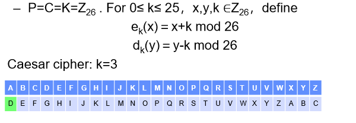
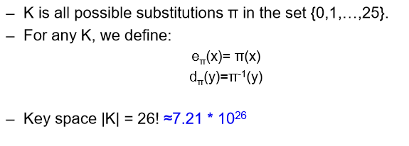

## AES (Advanced Encryption Standard)

The Advanced Encryption Standard (AES) is a symmetric encryption algorithm that was established as a standard by the U.S. National Institute of Standards and Technology (NIST) in 2001. Here's a summarized breakdown of the details provided:

**Requirements**

```{toggle}
- AES should be **publicly** defined (it's workings would be known to all)
- AES shall be a **symmetric block cipher** AES shall be designed so that the **key
  length may be increased**
- AES should be implementable in hardware and software
- AES shall be freely available
```

### Overview

1. **Variable Key and Block Lengths**:
    - AES supports key lengths of 128, 192, or 256 bits.
    - It can operate on blocks of 128, 192, or 256 bits.
    - While **any combination** of key and block length is possible, standard AES uses a fixed block size of 128 bits and varying key sizes (128, 192, 256 bits).
    - Extensions exist that allow it to handle block and key lengths of 160 and 224 bits.

2. **State Matrix**:
    - The input block is transformed into a matrix of bytes referred to as the "**state.**"
    - This matrix always has **4 rows** and a **variable number of columns** based on the block's size.
    - Standard AES uses a block size of 128 bits, which means a $4 \times 4$ state matrix.
        - **128 bits = 16 bytes.**
        - To fit all 16 bytes into this matrix, it needs **4 columns** (because $4 \times 4 = 16$).

### Structure of AES

- **Rounds**:
  - Just like DES (Data Encryption Standard), AES operates in multiple rounds.
  - The number of rounds AES uses depends on the key length:
    - 10 rounds for 128-bit key
    - 12 rounds for 192-bit key
    - 14 rounds for 256-bit key

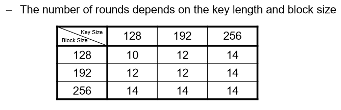

- **Stages of Each Round**:
Each round in AES comprises four stages:

    1. **Byte Substitution Transformation (ByteSub)**: Non-linear substitution
       step where each byte is replaced with another according to a lookup
       table.
    2. **Shift Rows Transformation (ShiftRows)**: A transposition step where the
       The last three rows of the state are shifted cyclically.
    3. **Mix Column Transformation (MixColumns)**: A mixing operation that
       operates on the columns of the state, combining the four bytes in each
       column.
    4. **Round Key Addition (AddRoundKey)**: The subkey is combined with the
       state using the bitwise `XOR` operation.

#### Byte Substitution Transformation

- A **non-linear** byte by byte substitution. The same substitution is performed on every byte.

- The substitution is based on a mathematical inverse and
then an affine function (**multiply + addition**).

- In practice, this is usually done via a 128 ($2^8$) entry lookup table called an **S-box**.
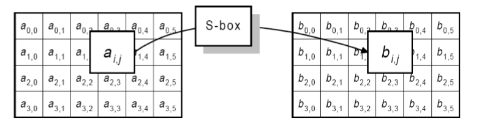

#### Shift Rows Transformation

- Each row in the state is then shifted (cyclically) by a specified offset based
  on the block size.
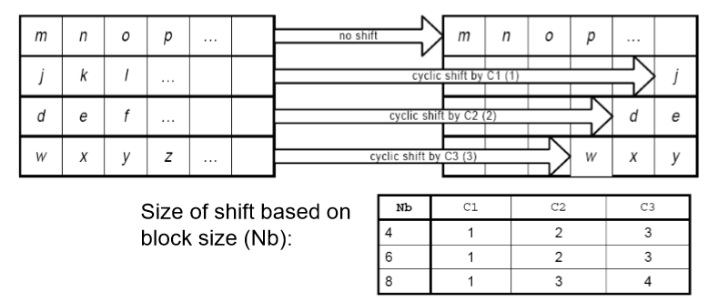

#### Mix Column Transformation

- Each column in the state is applied with the following matrix multiplication:

$$
\begin{bmatrix}
b_0 \\
b_1 \\
b_2 \\
b_3 \\
\end{bmatrix}
=
\begin{bmatrix}
02 & 03 & 01 & 01 \\
01 & 02 & 03 & 01 \\
01 & 01 & 02 & 03 \\
03 & 01 & 01 & 02 \\
\end{bmatrix}
\begin{bmatrix}
a_0 \\
a_1 \\
a_2 \\
a_3 \\
\end{bmatrix}
$$

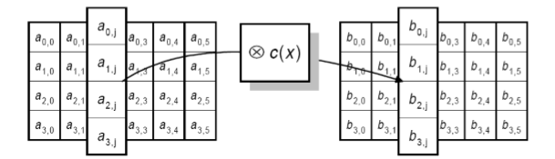

#### Round Key Addition

1. Generating round keys from the original key for each round using a **key schedule algorithm**.
2. Each byte of the state is then `XOR`'ed with the corresponding byte of the round key to produce the input for the next round.

In matrix notation, given the state matrix $ a $ and the round key matrix $ k $, the result after the `XOR` operation, $ b $, can be represented as:

$$ b = a \oplus k $$

Where:

- $ a $ is the current state matrix.
- $ k $ is the round key matrix.
- $ b $ is the resulting state matrix after `XOR`'ing.

The above operation is performed for each round of the AES encryption process.
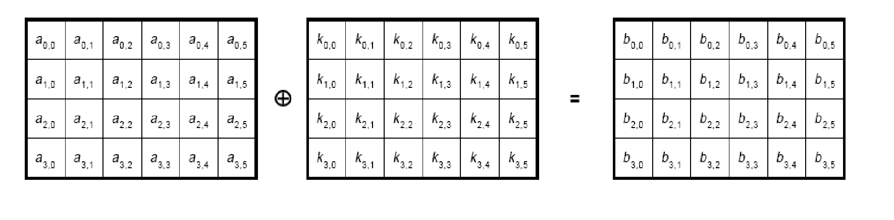

## Block Cipher Encryption Modes Summary

- Block ciphers are often utilized to encrypt data chunks larger than a block.
  The challenge is to do this securely.
- Different modes of block ciphers exist. Their distinctions lie in the following:

  1. **Security**: Determined by their security attributes.
  2. **Performance**: Evaluated by the supported throughput.
  3. **Error Propagation**: Effect of bit errors during the transmission of the cipher text.
  4. **Error Recovery**: Focused on recovering from transmission errors and
     determining the amount of data that needs retransmission.

### Electronic Codebook (ECB) Mode

- **Overview**:
  - ECB mode is the simplest encryption mode.
  - Messages are divided into block-sized chunks.
  - Padding is added to the final block if necessary.
  - Each chunk is encrypted on its own.

- **Properties**:
  1. **Security**: Poor
     - ECB offers weak security.
     - An adversary can add, remove, or reorder blocks.
     - Identical plaintext blocks produce identical ciphertext blocks, revealing data patterns.

     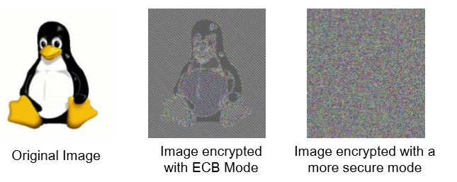
  2. **Performance**: High
     - Highly parallelizable as each block is encrypted independently.
     - Throughput is directly tied to the block cipher's speed.
  3. **Error Propagation**: Confinded to the impacted block.
     - Transmission errors in ciphertext only influence the associated plaintext block, leading to random changes in the block.
  4. **Error Recovery**: Easy
     - Errors are confined to the impacted block.
     - Blocks before and after the error remain unaffected and are decrypted correctly.
     - Only the affected blocks need to be retransmitted.
     - Decryption continues by skipping the faulty blocks.

### Cipher Block Chaining (CBC) Mode

- **Overview**:
  - CBC mode links each block's encryption to the previous block's ciphertext.
  - An Initial Value (IV) is used for the first block. While IV doesn't need to be a secret, it's vital to avoid using the same IV repeatedly.
  
  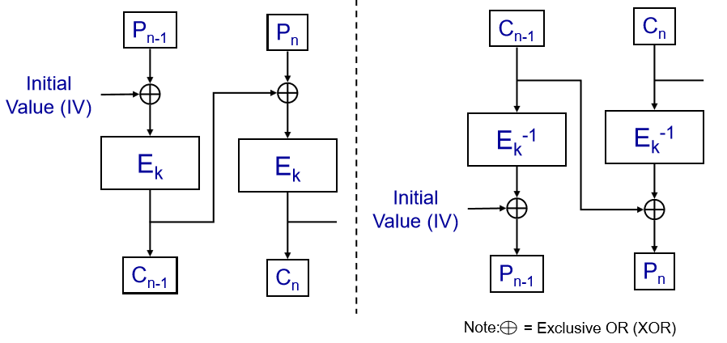

- **Properties**:
  1. **Security**: Strong
     - CBC provides robust security.
     - Any alteration in the plaintext impacts all subsequent blocks.
     - Identical plaintext blocks produce different ciphertext blocks due to the chaining.
  2. **Performance**: Encryption is slow, but decryption is fast.
     - Encryption has to be sequential, with no possibility for parallelization.
     - However, decryption can be performed in parallel.
  3. **Error Propagation**: Local
     - Transmission errors influence both the current block and the next block.
  4. **Error Recovery**: Easy
     - The receiver has the option to omit the affected blocks and proceed with decryption.

## Ways Around Ciphers like AES?

- One thing to note is that attackers often employ tactics that don't adhere to the expected "rules" – in short, attackers always cheat!

## Side Channels

Side-channel cryptanalysis represents a category of attacks targeting
cryptosystems. Instead of directly attacking the cryptographic algorithm, these
attacks exploit the information inadvertently emitted as a result of the
physical implementation of the system.

- Characteristics that attackers might observe or measure include:
  - Time taken by certain operations.
  - Power consumption patterns.
  - Noise emitted during processes.
  - Heat generated.
  - Electromagnetic radiation produced.
  - Among others...

This means that even if the algorithm itself is theoretically secure, its physical implementation might introduce vulnerabilities.

### Examples

[Extracting private keys from hardware by analyzing its power usage]( https://johoe.mooo.com/trezor-power-analysis/)

- 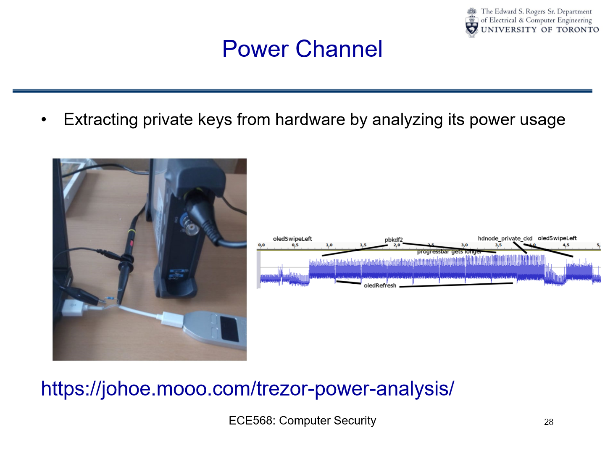
- 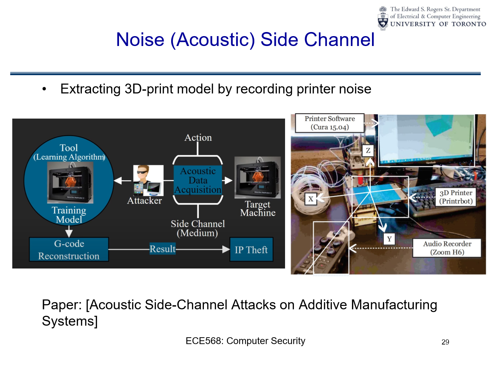
- 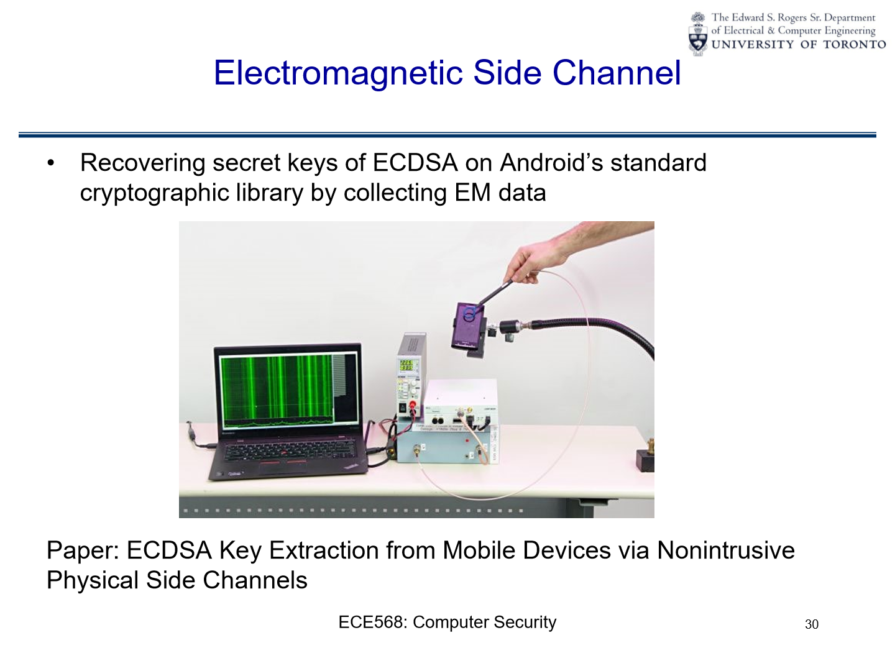
- 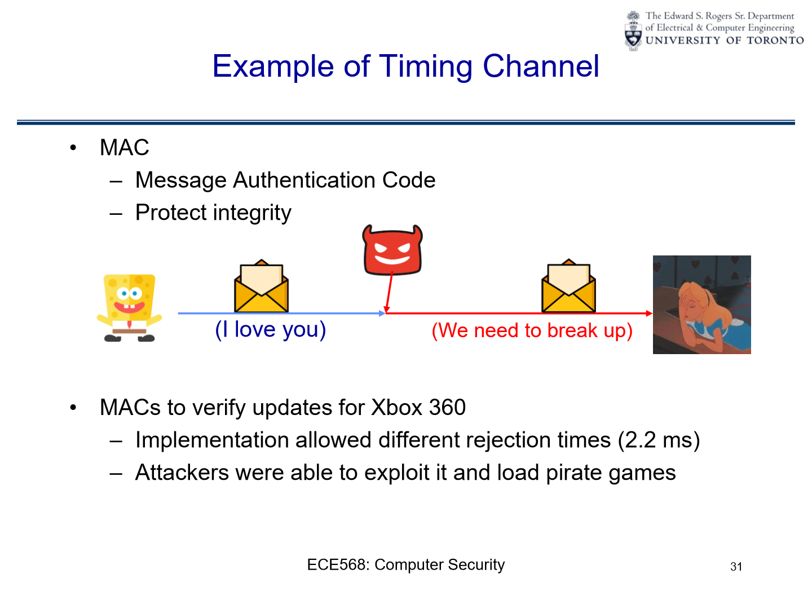

## Timing Side Channel Attack

The exploitation of timing differences, or timing attacks, is a subset of
side-channel attacks where the attacker tries to discover sensitive information
by observing and analyzing the time it takes for a system to process different
operations.

Here's how a timing difference can lead to an attack:

1. **Information Leakage**: At the most basic level, timing attacks exploit the
   fact that different operations or processes may take different amounts of
   time. By precisely measuring the time it takes for a system to respond to
   various inputs, an attacker can infer information about the system's internal
   operations.

2. **Pattern Recognition**: Over multiple observations, attackers can recognize
   patterns in timing differences. These patterns can reveal information about
   the **underlying algorithms** or even **secret keys** used within cryptographic
   operations.

3. **Variable vs. Constant Time Operations**: Ideally, cryptographic operations
   should take a The exploitation of timing differences, or timing attacks, is a
   subset of side-channel attacks where the attacker tries to discover sensitive
   information by observing and analyzing the time it takes for a system to
   process different operations.

Here's how a timing difference can lead to an attack:

1. **Information Leakage**: At the most basic level, timing attacks exploit the
   fact that different operations or processes may take different amounts of
   time. By precisely measuring the time it takes for a system to respond to
   various inputs, an attacker can infer information about the system's internal
   operations.

2. **Pattern Recognition**: Over multiple observations, attackers can recognize
   patterns in timing differences. These patterns can reveal information about
   the underlying algorithms or even secret keys used within cryptographic
   operations.

3. **Variable vs. Constant Time Operations**: **Ideally**, cryptographic
   operations should take a **constant amount of time** regardless of the input
   or any secret values (like cryptographic keys). However, certain operations,
   such as looking up values in a table or conditional branches based on secret
   data, might vary in execution time. These variations can leak information.

4. **Example with MACs**: Let's say an attacker sends an **incorrect MAC** to a
   system and observes how long the system takes to reject it. If the system
   checks each bit or byte of the MAC **sequentially** and stops checking once
   it finds an incorrect bit/byte, then a MAC that's rejected more quickly
   indicates that it was incorrect earlier in its sequence. By trying many such
   MACs and measuring the rejection times, an attacker can potentially deduce
   the correct MAC bit-by-bit or byte-by-byte.

5. **Real-world Scenario with Xbox 360**: In the case of the Xbox 360 mentioned
   earlier, if the system took longer to reject certain malicious updates than
   others, it indicates to the attacker that a part of their malicious update
   was closer to being correct. By iteratively adjusting and resending updates
   while observing rejection times, they could progressively craft an update
       that the system would accept.

6. **Mitigations**: To prevent timing attacks, developers can ensure that their
   systems process data in constant time, irrespective of input values. This
   means that the time taken for any operation should remain the same, whether
   the input is entirely correct, entirely wrong, or anywhere in between.

In summary, timing attacks hinge on the principle that "how long something takes
can reveal what's happening behind the scenes." **Small, consistent
differences** in timing can be exploited by attackers to reveal sensitive
internal information or processes. of time regardless of the input or any secret
values (like cryptographic keys). However, certain operations, such as looking
up values in a table or conditional branches based on secret data, might vary in
execution time. These variations can leak information.

### Code

```c
int naive_mac_check(char *test, char* correct) {
    return (strcmp(test, correct) == 0);
}

int strcmp(char *s1, char* s2) {
    while (*s1 != '\0' &&*s1 == *s2) {
        s1++;
        s2++;
    }
    return (*s1 - *s2);
}
```

### Exploitation

The slides provided discuss various aspects of the AES (Advanced Encryption Standard) implementation, particularly focusing on the T-Table approach. Let's break down the content slide by slide:

1. **Revisit AES Implementation**:
    - $X_i$ is the input data for the round and $K_i$ is the round key.
    - The operations for a single round include:
        - **SubBytes**: This step substitutes each byte in the block with another byte from the AES substitution box (S-box).
        - **ShiftRows**: This operation cyclically shifts the rows of the state.
        - **MixColumns**: This step mixes up the columns, providing diffusion in the cipher.
        - **`XOR` with Round Key**: The result from the above operations is then `XOR`ed with the round key $K_i$.

    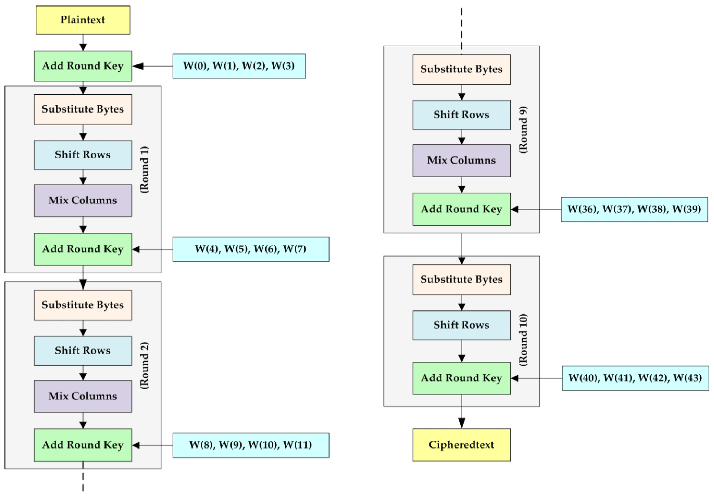

2. **T-Table Details of AES**:

    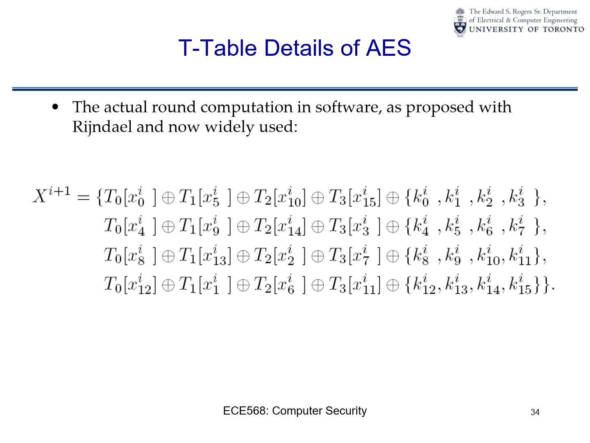

    - **Rijndael and T-tables**:
        - Rijndael is the name of the cipher selected as AES. The slide mentions that this implementation follows the approach proposed with Rijndael and is now widely used, which is using T-tables to optimize the AES algorithm in software.
        - T-tables are precomputed tables that combine multiple steps of the AES round into a single lookup, providing a speed-up.

    - **The T-tables Computation**:
        - The equation $X^{i+1}$ describes the state of the data after processing it through one round of AES encryption.
        - The T-tables $T_0$, $T_1$, $T_2$, and $T_3$ are used to perform the SubBytes, ShiftRows, and MixColumns steps of the AES round in a single operation. They are indexed by byte values from the current state, represented as $x^i_j$, where $i$ is the round number and $j$ is the byte's position within the state.
        - The $\oplus$ symbol represents the bitwise `XOR` operation.

    - **Process Breakdown**:
        - For each line in the equation, we see that byte values from the current state ($x^i_j$) are used as indices to lookup values in the T-tables.
        - These looked-up values are then `XOR`'ed together with round key bytes $k^i_j$.
        - The result of this operation updates the state matrix for the next round, represented as $X^{i+1}$.

    - **Relation to AES**:
        - Normally, in AES, the SubBytes step involves a byte-by-byte
          substitution from the S-box. The ShiftRows step rotates the rows of
          the state, and the MixColumns step mixes the columns. Finally, the
          AddRoundKey step `XOR`s the round key with the state.
        - In this T-table optimized approach, the SubBytes, ShiftRows, and
          MixColumns operations are merged into one table lookup. The result of
          the lookup is then `XOR`'ed with the round key (AddRoundKey step).

3. **T-Table Implementation in AES**:

    
    - **T-table Computations**:
       - The T-tables are denoted as `Te0`, `Te1`, `Te2`, and `Te3`.
       - For each of the four words (t0, t1, t2, t3) in the state matrix, there
         are corresponding calculations involving these T-tables. Each word from
         the state matrix (e.g., `s0`, `s1`, `s2`, `s3`) is broken down into
         bytes.
       - The bitwise right shift operation (e.g., `>> 24`, `>> 16`, `>> 8`) and
         the bitwise AND operation with `0xff` are used to extract specific
         bytes from the words.
       - These bytes are then used to index into the T-tables, and the results
         from the tables are `XOR`ed together to produce each word in the updated
         state matrix.
       - The `rk` variables represent the round keywords, which are `XOR`ed with
         the results to complete the round transformation.

    - **Example of a T-table Array**:
       - The slide gives an example of the `Te0` table, which contains **256
         precomputed 32-bit values**. These values are the results of multiple
         AES operations combined, which speeds up the encryption process when
         used in the T-table lookup method.

### Analysis of t-table lookups

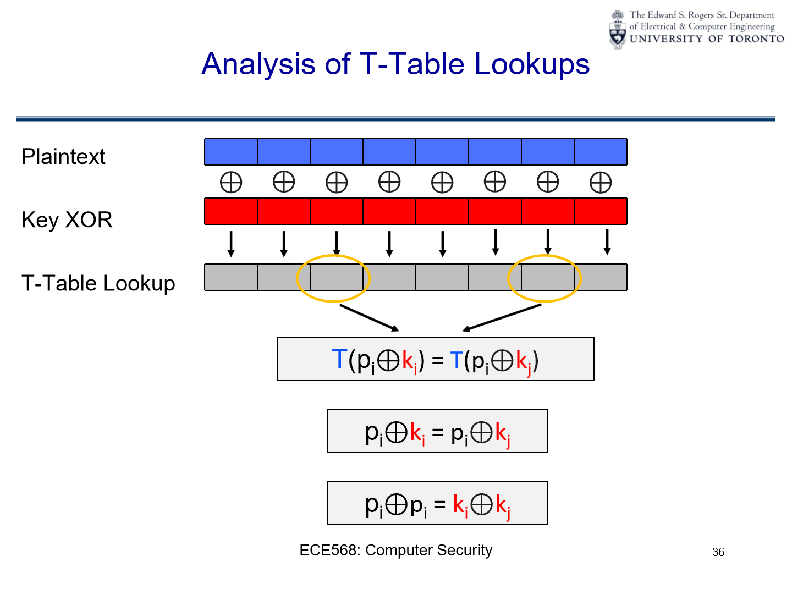

1. **plaintext and key `XOR`**:
   - the illustration depicts the plaintext (in blue) and its interaction with the key (in red) via the `XOR` operation.

2. **t-table lookup flow**:
   - after `XOR`ing the plaintext with the key, specific parts of the result are used to perform lookups in the t-tables. this is represented by the arrows pointing to the "t-table lookup" bar.

3. **t-table lookup equations**:
    - **If** $T(p_i \oplus k_i) = T(p_i \oplus k_j) $:

    - **then** $ p_i \oplus k_i = p_i \oplus k_j $:

        If both sides of the equation are equal, it implies either $ k_i = k_j $
        or there's some relationship between the plaintext and the keys that
        makes this equation hold true.

    - $ p_i \oplus p_i = k_i \oplus k_j $:

       This equation demonstrates a fundamental property of `XOR`: any value `XOR`ed
       with itself yields 0. This means that $ p_i \oplus p_i $ is 0 and $ k_i
       \oplus k_j $ is also 0, which further implies $ k_i = k_j $ for this
       equation to hold true. Essentially, both sides of the equation will yield
       the value 0.

#### Exploit Cache Timing Channel

- In order to know if $x=y$ for $T(x)=T(y)$, we can use a cache timing channel.

A **cache timing channel attack** exploits the time taken
to retrieve a memory value to infer something about the system's state. When
data is in the cache (a small, faster type of memory), accessing it is faster
than when it's in the main memory. So, by measuring how long it takes to access
certain information, an attacker might determine whether a specific operation
was performed or deduce the value of a secret key in use.

In simple terms, **if two values x and y lead to the same location** in the T-table,
accessing one after the other would be **faster** than if they were located in
different parts of the memory. By observing these timing differences, one can
infer that x=y for the given T-table lookups.

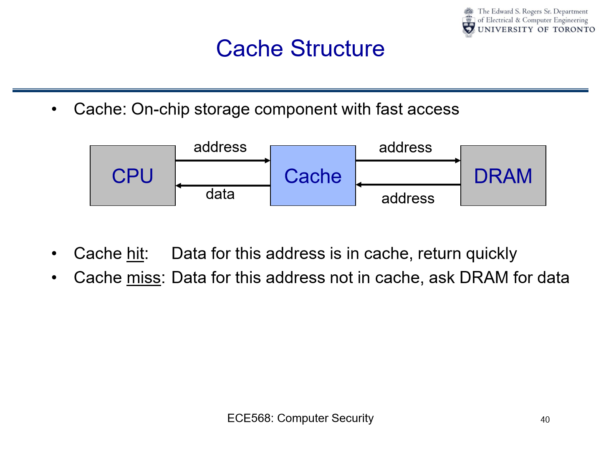
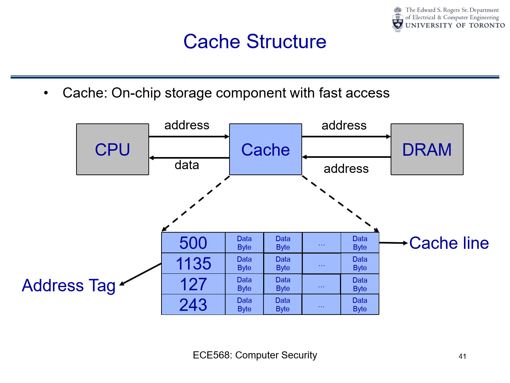
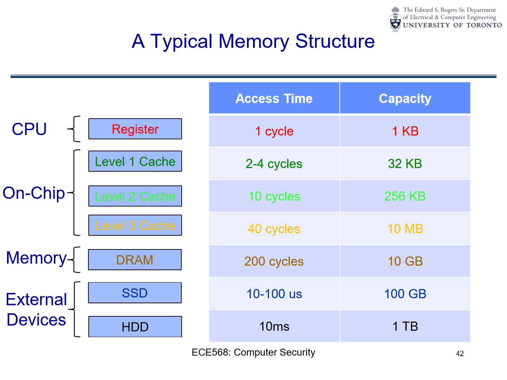
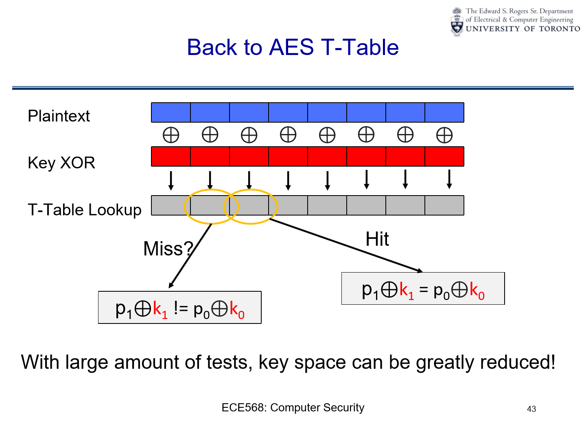

#### Implementation of Attack

The provided diagram represents the "Implementation of Cache Attack," a type of side-channel attack where the attacker exploits the behaviour of the system cache to gain insights into a victim's operations. Let's break it down:


1. **Execution**:
    - This represents the timeline of events or the sequence of actions taken by
      the attacker and the victim.

2. **Attacker Prime**:
    - At this stage, the attacker intentionally accesses specific memory
      locations. The purpose of this action is to "prime" the cache, filling it
      with data that the attacker knows and controls.
    - When the attacker accesses these memory locations, the related cache lines
      are loaded with the attacker's data. This effectively establishes a known
      state for the cache.

3. **Victim Access**:
    - After the attacker primes the cache, the victim's process or application
      (which could be any operation, but often an encryption operation in this
      context) runs.
    - As the victim's process accesses memory, certain cache lines may be
      displaced or overwritten with new data. This is because the cache has a
      limited size, and when new data is loaded into the cache, some old data
      has to be evicted.
    - The cache lines that get evicted and loaded with the victim's data can
      provide hints about which memory locations the victim accessed.

4. **Attacker Probe**:
    - Following the victim's access, the attacker probes the same memory
      locations that were initially primed.
    - By measuring the time it takes to access each location, the attacker can
      determine which locations were accessed by the victim:
        - If the access is fast (cache hit), it implies that the victim didn't
          access that memory location, and the data in the cache is still from
          the attacker's initial prime.
        - If the access is slower (cache miss), it suggests the victim did
          access that location, causing the attacker's data to be evicted from
          the cache and replaced with the victim's data.

5. **Cache**:
    - The cache is divided into multiple "cache lines," which are slots where
      data from memory can be stored for faster access.
    - In this illustration, there are eight cache lines (from Cache line 0 to
      Cache line 7). The arrows show the flow of data as it's loaded into the
      cache during the various stages.

6. **Time**:
    - The horizontal progression represents the chronological sequence of
      events, starting with the attacker's prime, followed by the victim's
      access, and finally, the attacker's probe.

In summary, by strategically priming the cache and then observing the effects of
the victim's operations on the cache, an attacker can infer information about
the victim's activities. For instance, in cryptographic contexts, such patterns
can potentially reveal information about cryptographic keys or algorithms being
used. This side-channel attack exploits the unintended information leakage from
the hardware behaviour rather than directly breaking the cryptographic process.
